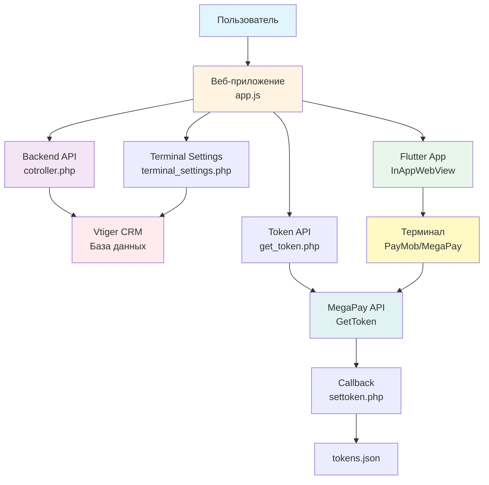
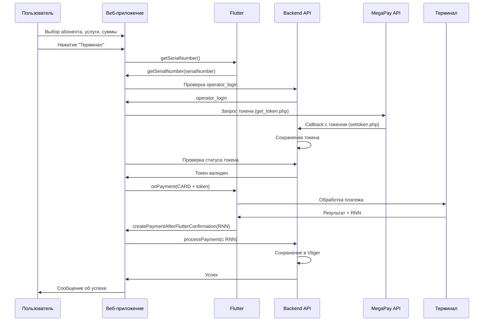

# Схема взаимодействия компонентов системы

## Архитектура взаимодействия

```
┌─────────────────────────────────────────────────────────────────────────┐
│                         ВЕБ-ПРИЛОЖЕНИЕ (JavaScript)                      │
│                              app.js + index.html                          │
│                                                                           │
│  ┌─────────────────┐  ┌──────────────────┐  ┌──────────────────────┐  │
│  │  Авторизация    │  │  Поиск абонентов  │  │  Создание платежей   │  │
│  │  (Vtiger CRM)   │  │  (Vtiger CRM)     │  │  (CASH / CARD)       │  │
│  └─────────────────┘  └──────────────────┘  └──────────────────────┘  │
└─────────────────────────────────────────────────────────────────────────┘
                              │                    │
                              │                    │
                    ┌─────────▼─────────┐  ┌─────▼──────────────┐
                    │  Flutter App       │  │  Backend API        │
                    │  (InAppWebView)    │  │  (cotroller.php)    │
                    └─────────┬──────────┘  └─────┬───────────────┘
                              │                    │
                              │                    │
                    ┌─────────▼──────────┐        │
                    │  Терминал           │        │
                    │  (MegaPay/PayMob)   │        │
                    └─────────────────────┘        │
                              │                    │
                              │                    │
                    ┌─────────▼──────────┐        │
                    │  MegaPay API        │        │
                    │  (GetToken)         │        │
                    └─────────────────────┘        │
                              │                    │
                              │                    │
                    ┌─────────▼──────────┐        │
                    │  ЯКасса             │        │
                    │  (Платежный шлюз)   │        │
                    └─────────────────────┘        │
```

---

## Детальная схема взаимодействия

### 1. Процесс авторизации

```
┌──────────────┐         ┌──────────────┐         ┌──────────────┐
│   Пользователь│         │  Веб-приложение│       │  Backend API │
│              │         │  (app.js)    │         │(cotroller.php)│
└──────┬───────┘         └──────┬───────┘         └──────┬───────┘
       │                        │                        │
       │ 1. Ввод логина/пароля  │                        │
       ├───────────────────────>│                        │
       │                        │                        │
       │                        │ 2. checkUser          │
       │                        ├───────────────────────>│
       │                        │                        │
       │                        │ 3. Проверка в Vtiger  │
       │                        │<───────────────────────┤
       │                        │                        │
       │                        │ 4. addAuth/updateAuth  │
       │                        ├───────────────────────>│
       │                        │                        │
       │                        │ 5. Сохранение сессии  │
       │                        │<───────────────────────┤
       │                        │                        │
       │ 6. Успешная авторизация│                        │
       │<───────────────────────┤                        │
       │                        │                        │
```

---

### 2. Процесс наличного платежа (CASH)

```
┌──────────────┐         ┌──────────────┐         ┌──────────────┐         ┌──────────────┐
│   Пользователь│         │  Веб-приложение│       │  Flutter App │         │  Backend API │
│              │         │  (app.js)    │         │              │         │(cotroller.php)│
└──────┬───────┘         └──────┬───────┘         └──────┬───────┘         └──────┬───────┘
       │                        │                        │                        │
       │ 1. Выбор абонента      │                        │                        │
       │    Выбор услуги        │                        │                        │
       │    Ввод суммы         │                        │                        │
       ├───────────────────────>│                        │                        │
       │                        │                        │                        │
       │ 2. Нажатие "Наличные" │                        │                        │
       ├───────────────────────>│                        │                        │
       │                        │                        │                        │
       │                        │ 3. onPayment(CASH)     │                        │
       │                        ├───────────────────────>│                        │
       │                        │                        │                        │
       │                        │                        │ 4. Обработка наличного  │
       │                        │                        │    платежа              │
       │                        │                        │                        │
       │                        │ 5. createPaymentAfter │                        │
       │                        │    FlutterConfirmation │                        │
       │                        │<───────────────────────┤                        │
       │                        │                        │                        │
       │                        │ 6. processPayment      │                        │
       │                        ├─────────────────────────────────────────────────>│
       │                        │                        │                        │
       │                        │                        │ 7. Сохранение в Vtiger │
       │                        │                        │<───────────────────────┤
       │                        │                        │                        │
       │                        │ 8. Успех               │                        │
       │                        │<─────────────────────────────────────────────────┤
       │                        │                        │                        │
       │ 9. Сообщение об успехе │                        │                        │
       │<───────────────────────┤                        │                        │
       │                        │                        │                        │
```

---

### 3. Процесс терминального платежа (CARD) - Полный цикл

```
┌──────────────┐  ┌──────────────┐  ┌──────────────┐  ┌──────────────┐  ┌──────────────┐  ┌──────────────┐
│   Пользователь│  │  Веб-приложение│  │  Flutter App │  │  Backend API │  │  MegaPay API│  │  Терминал    │
│              │  │  (app.js)    │  │              │  │(cotroller.php)│  │              │  │  (PayMob)    │
└──────┬───────┘  └──────┬───────┘  └──────┬───────┘  └──────┬───────┘  └──────┬───────┘  └──────┬───────┘
       │                 │                 │                 │                 │                 │
       │ 1. Выбор абонента, услуги, суммы│                 │                 │                 │
       ├─────────────────────────────────>│                 │                 │                 │
       │                 │                 │                 │                 │                 │
       │ 2. Нажатие "Терминал"            │                 │                 │                 │
       ├─────────────────────────────────>│                 │                 │                 │
       │                 │                 │                 │                 │                 │
       │                 │ 3. getSerialNumber                │                 │                 │
       │                 ├───────────────────────────────────>│                 │                 │
       │                 │                 │                 │                 │                 │
       │                 │                 │ 4. Серийный номер│                 │                 │
       │                 │                 │    терминала      │                 │                 │
       │                 │<───────────────────────────────────┤                 │                 │
       │                 │                 │                 │                 │                 │
       │                 │ 5. Проверка operator_login в БД    │                 │                 │
       │                 ├─────────────────────────────────────>│                 │                 │
       │                 │                 │                 │                 │                 │
       │                 │                 │                 │ 6. operator_login│                 │
       │                 │                 │                 │<─────────────────┤                 │
       │                 │                 │                 │                 │                 │
       │                 │ 7. Запрос токена (get_token.php)   │                 │                 │
       │                 ├───────────────────────────────────────────────────────────────────────>│
       │                 │                 │                 │                 │                 │
       │                 │                 │                 │                 │ 8. GetToken      │
       │                 │                 │                 │                 │    запрос        │
       │                 │                 │                 │                 ├─────────────────>│
       │                 │                 │                 │                 │                 │
       │                 │                 │                 │                 │ 9. Токен         │
       │                 │                 │                 │                 │    (callback)     │
       │                 │                 │                 │                 │<─────────────────┤
       │                 │                 │                 │                 │                 │
       │                 │                 │                 │ 10. Сохранение  │                 │
       │                 │                 │                 │     токена       │                 │
       │                 │                 │                 │<─────────────────┤                 │
       │                 │                 │                 │                 │                 │
       │                 │ 11. Получение токена (get_token_status.php)│                 │                 │
       │                 ├─────────────────────────────────────>│                 │                 │
       │                 │                 │                 │                 │                 │
       │                 │                 │                 │ 12. Токен        │                 │
       │                 │                 │                 │<─────────────────┤                 │
       │                 │                 │                 │                 │                 │
       │                 │ 13. onPayment(CARD + token)         │                 │                 │
       │                 ├───────────────────────────────────>│                 │                 │
       │                 │                 │                 │                 │                 │
       │                 │                 │ 14. Обработка    │                 │                 │
       │                 │                 │    платежа через │                 │                 │
       │                 │                 │    терминал      │                 │                 │
       │                 │                 ├─────────────────────────────────────────────────────>│
       │                 │                 │                 │                 │                 │
       │                 │                 │                 │                 │                 │ 15. Оплата
       │                 │                 │                 │                 │                 │    картой
       │                 │                 │                 │                 │                 │<───┤
       │                 │                 │                 │                 │                 │
       │                 │                 │                 │                 │                 │ 16. RNN
       │                 │                 │                 │                 │                 ├───>│
       │                 │                 │                 │                 │                 │
       │                 │                 │ 17. Результат + RNN│                 │                 │                 │
       │                 │                 │<─────────────────────────────────────────────────────┤
       │                 │                 │                 │                 │                 │
       │                 │ 18. createPaymentAfterFlutterConfirmation│                 │                 │                 │
       │                 │<───────────────────────────────────┤                 │                 │
       │                 │                 │                 │                 │                 │
       │                 │ 19. processPayment (с RNN)          │                 │                 │
       │                 ├─────────────────────────────────────>│                 │                 │
       │                 │                 │                 │                 │                 │
       │                 │                 │                 │ 20. Сохранение   │                 │
       │                 │                 │                 │    в Vtiger      │                 │
       │                 │                 │                 │<─────────────────┤                 │
       │                 │                 │                 │                 │                 │
       │                 │                 │                 │ 21. Успех         │                 │
       │                 │                 │                 │<─────────────────┤                 │
       │                 │                 │                 │                 │                 │
       │                 │ 22. Успех                           │                 │                 │
       │                 │<─────────────────────────────────────┤                 │                 │
       │                 │                 │                 │                 │                 │
       │ 23. Сообщение об успехе│                 │                 │                 │                 │
       │<─────────────────────────────────┤                 │                 │                 │
       │                 │                 │                 │                 │                 │
```

---

## Компоненты системы

### 1. Веб-приложение (JavaScript)
- **Файлы:** `app.js`, `index.html`, `language.js`, `style.css`
- **Функции:**
  - Авторизация пользователей
  - Поиск абонентов
  - Создание платежей (CASH/CARD)
  - Управление токенами
  - Взаимодействие с Flutter через `window.flutter_inappwebview`

### 2. Flutter приложение
- **Роль:** Мобильное приложение-обертка
- **Функции:**
  - Предоставление серийного номера терминала
  - Обработка платежей через терминал
  - Возврат результатов платежей (RNN)
  - Управление наличными платежами

### 3. Backend API (PHP)
- **Файлы:** `cotroller.php`, `terminal_settings.php`
- **Функции:**
  - Авторизация через Vtiger CRM
  - Поиск абонентов в Vtiger
  - Создание платежей в Vtiger
  - Управление настройками терминалов
  - Логирование операций

### 4. MegaPay API
- **Файлы:** `get_token.php`, `settoken.php`, `get_token_status.php`
- **Функции:**
  - Получение токенов авторизации для терминалов
  - Callback для сохранения токенов
  - Проверка статуса токенов

### 5. Терминал (PayMob/MegaPay)
- **Роль:** Физическое устройство для приема платежей
- **Функции:**
  - Прием платежей по картам
  - Генерация RNN (Retrieval Reference Number)
  - Возврат результатов транзакций

### 6. ЯКасса (опционально)
- **Роль:** Дополнительный платежный шлюз
- **Примечание:** Может использоваться для альтернативных методов оплаты

---

## Потоки данных

### Поток 1: Авторизация
```
Пользователь → Веб-приложение → Backend API → Vtiger CRM
                                      ↓
                              Сохранение сессии
                                      ↓
                              Веб-приложение ← Backend API
```

### Поток 2: Поиск абонентов
```
Пользователь → Веб-приложение → Backend API → Vtiger CRM
                                      ↓
                              Результаты поиска
                                      ↓
                              Веб-приложение ← Backend API
```

### Поток 3: Наличный платеж
```
Пользователь → Веб-приложение → Flutter → Обработка
                                      ↓
                              Результат
                                      ↓
                              Веб-приложение → Backend API → Vtiger CRM
```

### Поток 4: Терминальный платеж
```
Пользователь → Веб-приложение → Flutter → Терминал (PayMob)
                                      ↓
                              MegaPay API (токен)
                                      ↓
                              Терминал → Обработка платежа
                                      ↓
                              RNN → Flutter → Веб-приложение → Backend API → Vtiger CRM
```

---

## Технологии и протоколы

### Коммуникация между компонентами:

1. **Веб-приложение ↔ Flutter**
   - Протокол: JavaScript Bridge (`window.flutter_inappwebview`)
   - Методы:
     - `callHandler("getSerialNumber")`
     - `callHandler("onPayment", data)`
     - `callHandler("onMunicipalLogout")`
   - Callbacks:
     - `window.getSerialNumber(serialNumber)`
     - `window.createPaymentAfterFlutterConfirmation(response)`

2. **Веб-приложение ↔ Backend API**
   - Протокол: HTTP/HTTPS
   - Формат: JSON
   - Метод: POST
   - Endpoint: `/controllers/cotroller.php`

3. **Backend API ↔ Vtiger CRM**
   - Протокол: PHP API
   - База данных: MySQL
   - Модули: Users, Estates, Payments

4. **Backend API ↔ MegaPay**
   - Протокол: HTTP/HTTPS
   - Формат: JSON
   - Endpoint: `https://core.megapay.pos.kg/json/GetToken`
   - Callback: `/controllers/settoken.php`

5. **Flutter ↔ Терминал**
   - Протокол: Специфичный для терминала PayMob/MegaPay
   - Данные: Платежные данные + токен авторизации
   - Результат: RNN транзакции

---

## Схема в формате Mermaid



---

## Последовательность операций (Sequence Diagram)

### Терминальный платеж (CARD)



---

## Ключевые моменты взаимодействия

### 1. Получение токена MegaPay
- **Инициатор:** Веб-приложение
- **Процесс:**
  1. Запрос серийного номера у Flutter
  2. Проверка operator_login в БД
  3. Отправка запроса в MegaPay API
  4. Получение токена через callback
  5. Сохранение токена в файл/БД

### 2. Обработка платежа через терминал
- **Инициатор:** Веб-приложение
- **Процесс:**
  1. Подготовка данных платежа + токен
  2. Отправка в Flutter
  3. Flutter передает в терминал
  4. Терминал обрабатывает платеж
  5. Возврат RNN через Flutter
  6. Создание записи в Vtiger с RNN

### 3. Наличный платеж
- **Инициатор:** Веб-приложение
- **Процесс:**
  1. Подготовка данных платежа
  2. Отправка в Flutter (без токена)
  3. Flutter обрабатывает наличный платеж
  4. Возврат результата
  5. Создание записи в Vtiger

---

## Безопасность

### Точки безопасности:

1. **Авторизация**
   - Проверка паролей через хеширование
   - Сессии с ограниченным временем жизни (7 дней)
   - Проверка активности пользователя

2. **Токены MegaPay**
   - Время жизни токена ограничено
   - Автоматическое обновление при необходимости
   - Проверка валидности перед использованием

3. **Платежи**
   - Валидация данных на сервере
   - Логирование всех операций
   - RNN для отслеживания транзакций

4. **Коммуникация**
   - HTTPS для всех внешних запросов
   - JSON валидация
   - Prepared statements для SQL

---

## Логирование

### Файлы логов:

1. **payments.log** - Все платежи
2. **token_requests.log** - Запросы токенов
3. **controller_error.log** - Ошибки PHP

### Что логируется:

- Создание платежей (успех/ошибка)
- Получение токенов
- Ошибки взаимодействия
- RNN транзакций

---

**Версия схемы:** 1.0  
**Дата создания:** 2024-01-15

