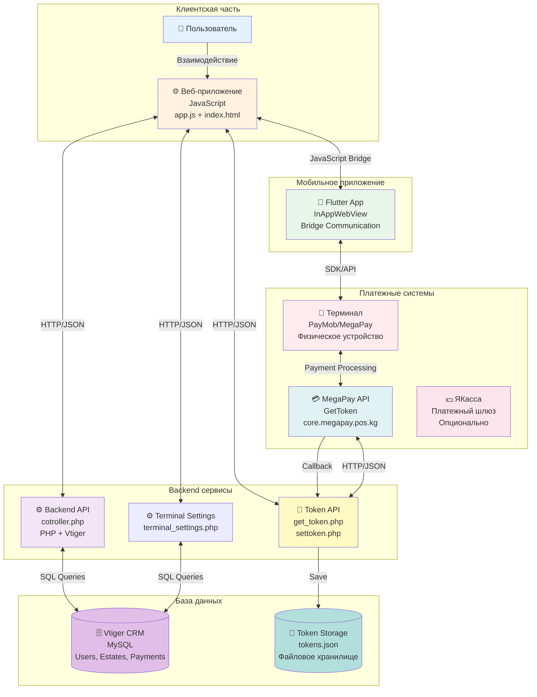
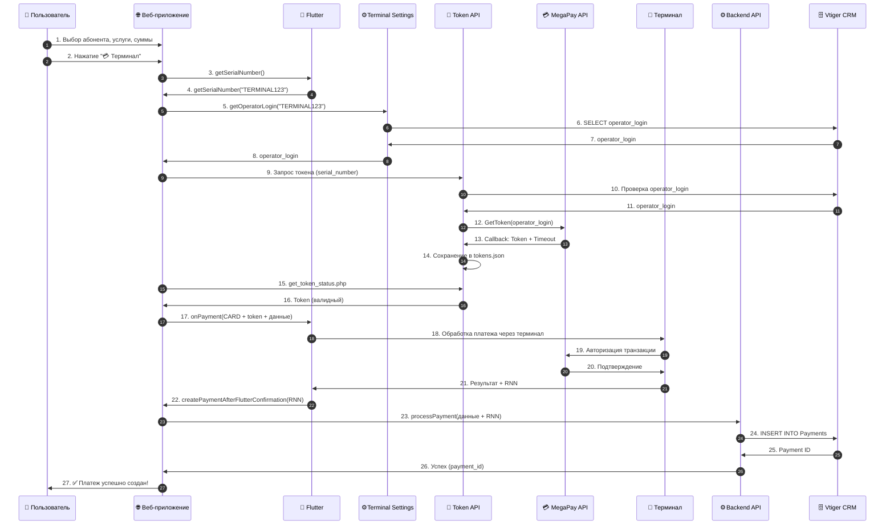
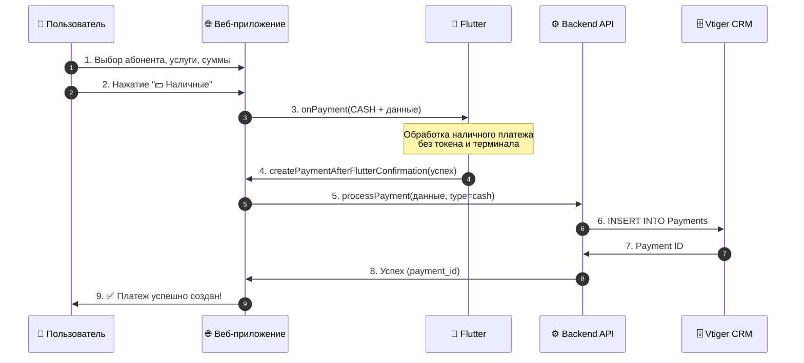
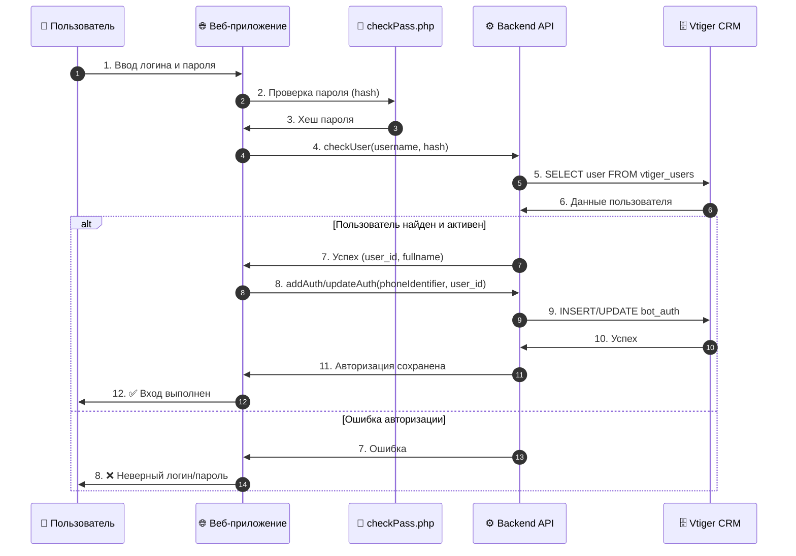
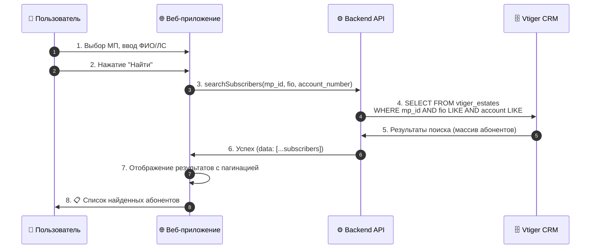

# Визуальная схема взаимодействия компонентов

## Общая архитектура системы



---

## Последовательность операций: Терминальный платеж (CARD)



---

## Последовательность операций: Наличный платеж (CASH)



---

## Последовательность операций: Авторизация



---

## Последовательность операций: Поиск абонентов



---

## Схема получения токена MegaPay

```mermaid
graph LR
    A[Веб-приложение<br/>Запрос токена] -->|1. serial_number| B[get_token.php]
    B -->|2. Проверка| C{operator_login<br/>в БД?}
    C -->|Нет| D[❌ Ошибка:<br/>operator_login не настроен]
    C -->|Да| E[3. Формирование запроса]
    E -->|4. HTTP POST| F[MegaPay API<br/>GetToken]
    F -->|5. Валидация| G{Валидные<br/>данные?}
    G -->|Нет| H[❌ Ошибка авторизации]
    G -->|Да| I[6. Генерация токена]
    I -->|7. Callback POST| J[settoken.php]
    J -->|8. Сохранение| K[tokens.json]
    K -->|9. Проверка статуса| L[get_token_status.php]
    L -->|10. Токен валиден| M[✅ Токен готов<br/>к использованию]
    
    style A fill:#fff3e0
    style B fill:#fff9c4
    style F fill:#e0f2f1
    style K fill:#b2dfdb
    style M fill:#c8e6c9
    style D fill:#ffcdd2
    style H fill:#ffcdd2
```



---

## Детальная схема компонентов

```
┌─────────────────────────────────────────────────────────────────────────────┐
│                          КЛИЕНТСКАЯ ЧАСТЬ                                     │
├─────────────────────────────────────────────────────────────────────────────┤
│                                                                               │
│  ┌─────────────────────────────────────────────────────────────────────┐    │
│  │                    ВЕБ-ПРИЛОЖЕНИЕ (JavaScript)                       │    │
│  │                                                                       │    │
│  │  ┌──────────────┐  ┌──────────────┐  ┌──────────────────────────┐   │    │
│  │  │ Авторизация   │  │ Поиск       │  │ Платежи                   │   │    │
│  │  │ - checkAuth   │  │ - search    │  │ - CASH (наличные)        │   │    │
│  │  │ - login       │  │ - services  │  │ - CARD (терминал)        │   │    │
│  │  │ - logout      │  │             │  │ - токены                  │   │    │
│  │  └──────────────┘  └──────────────┘  └──────────────────────────┘   │    │
│  │                                                                       │    │
│  │  JavaScript Bridge: window.flutter_inappwebview                     │    │
│  │  - callHandler("getSerialNumber")                                    │    │
│  │  - callHandler("onPayment", data)                                    │    │
│  │  - callHandler("onMunicipalLogout")                                  │    │
│  │                                                                       │    │
│  └─────────────────────────────────────────────────────────────────────┘    │
│                                                                               │
└─────────────────────────────────────────────────────────────────────────────┘
                                    │
                                    │ HTTP/JSON
                                    │ JavaScript Bridge
                                    │
        ┌───────────────────────────┼───────────────────────────┐
        │                           │                           │
        ▼                           ▼                           ▼
┌───────────────┐         ┌───────────────┐         ┌───────────────┐
│  FLUTTER APP  │         │  BACKEND API  │         │  TOKEN API     │
│               │         │               │         │               │
│ InAppWebView  │         │ cotroller.php │         │ get_token.php │
│               │         │               │         │ settoken.php  │
│ Handlers:     │         │ Actions:      │         │               │
│ - getSerial   │         │ - checkUser   │         │ Functions:    │
│   Number      │         │ - checkAuth   │         │ - GetToken    │
│ - onPayment   │         │ - search      │         │ - SaveToken   │
│ - onLogout    │         │ - payment     │         │ - CheckStatus │
│               │         │               │         │               │
└───────┬───────┘         └───────┬───────┘         └───────┬───────┘
        │                         │                         │
        │ SDK/API                 │ SQL                     │ HTTP/JSON
        │                         │                         │
        ▼                         ▼                         ▼
┌───────────────┐         ┌───────────────┐         ┌───────────────┐
│   ТЕРМИНАЛ    │         │  VTIGER CRM   │         │  MEGAPAY API   │
│               │         │               │         │               │
│ PayMob/MegaPay│         │ MySQL Database│         │ GetToken      │
│               │         │               │         │               │
│ Functions:    │         │ Tables:       │         │ Endpoint:     │
│ - Card Payment│         │ - vtiger_users│         │ core.megapay  │
│ - RNN Generate│         │ - vtiger_     │         │   .pos.kg     │
│ - Transaction │         │   estates     │         │               │
│   Result      │         │ - Payments    │         │ Callback:     │
│               │         │ - bot_auth    │         │ settoken.php  │
│               │         │ - terminal_   │         │               │
│               │         │   settings    │         │               │
└───────────────┘         └───────────────┘         └───────────────┘
        │                         │                         │
        │                         │                         │
        └─────────────────────────┼─────────────────────────┘
                                  │
                                  │ Payment Processing
                                  │
                          ┌───────▼───────┐
                          │   ЯКАССА      │
                          │  (Опционально)│
                          │               │
                          │ Платежный     │
                          │ шлюз          │
                          └───────────────┘
```

---

## Потоки данных

### Поток 1: Авторизация пользователя
```
[Пользователь]
    │
    │ Ввод логина/пароля
    ▼
[Веб-приложение]
    │
    │ HTTP POST: checkUser
    ▼
[Backend API]
    │
    │ SQL: SELECT FROM vtiger_users
    ▼
[Vtiger CRM]
    │
    │ Данные пользователя
    ▼
[Backend API]
    │
    │ SQL: INSERT INTO bot_auth
    ▼
[Vtiger CRM]
    │
    │ Успех авторизации
    ▼
[Веб-приложение]
    │
    │ Отображение интерфейса
    ▼
[Пользователь]
```

### Поток 2: Терминальный платеж
```
[Пользователь]
    │ Выбор абонента, услуги, суммы
    ▼
[Веб-приложение]
    │ getSerialNumber()
    ▼
[Flutter]
    │ serialNumber
    ▼
[Веб-приложение]
    │ Проверка operator_login
    ▼
[Backend API] → [Vtiger CRM]
    │ operator_login
    ▼
[Веб-приложение]
    │ Запрос токена
    ▼
[Token API] → [MegaPay API]
    │ Токен (callback)
    ▼
[Token API] → [tokens.json]
    │ Токен валиден
    ▼
[Веб-приложение]
    │ onPayment(CARD + token)
    ▼
[Flutter] → [Терминал] → [MegaPay]
    │ Результат + RNN
    ▼
[Flutter]
    │ createPaymentAfterFlutterConfirmation(RNN)
    ▼
[Веб-приложение]
    │ processPayment(данные + RNN)
    ▼
[Backend API] → [Vtiger CRM]
    │ Payment ID
    ▼
[Веб-приложение]
    │ Сообщение об успехе
    ▼
[Пользователь]
```

---

## Технические детали взаимодействия

### JavaScript ↔ Flutter

**Методы вызова Flutter из JavaScript:**
```javascript
// Получение серийного номера
window.flutter_inappwebview.callHandler("getSerialNumber");

// Отправка платежа
window.flutter_inappwebview.callHandler("onPayment", {
  action: "processPayment",
  ls: "12345",
  service_id: "1",
  amount: 1000.50,
  payment_type: "CARD",
  megapay_token: "token_here"
});

// Выход из МП
window.flutter_inappwebview.callHandler("onMunicipalLogout");
```

**Callbacks от Flutter в JavaScript:**
```javascript
// Получение серийного номера
window.getSerialNumber = function(serialNumber) {
  // Обработка
};

// Результат платежа
window.createPaymentAfterFlutterConfirmation = function(response) {
  // response.result.code === 0 - успех
  // response.transaction.instrumentSpecificData.rrn - RNN
};
```

### Веб-приложение ↔ Backend API

**Формат запроса:**
```json
POST /controllers/cotroller.php
Content-Type: application/json

{
  "action": "processPayment",
  "ls": "12345",
  "service_id": "1",
  "amount": 1000.50,
  "payment_type": "terminal",
  "rnn": "123456789012"
}
```

**Формат ответа:**
```json
{
  "success": true,
  "message": "Платёж успешно сохранён",
  "payment_id": "456"
}
```

### Backend API ↔ MegaPay

**Запрос токена:**
```json
POST https://core.megapay.pos.kg/json/GetToken
Content-Type: application/json

{
  "@MsgNum": "req_1234567890",
  "OpLogin": "operator@example.com",
  "SysLogin": "admin",
  "SysPwd": "hash_password",
  "Lang": "rus",
  "Info": "PHP Payment System v1.0"
}
```

**Callback от MegaPay:**
```json
POST /controllers/settoken.php
Content-Type: application/json

{
  "@MsgNum": "req_1234567890",
  "OpLogin": "operator@example.com",
  "Token": "abc123def456...",
  "TokenTimeout": 3600,
  "ServerTime": "15.01.2024 12:00:00 GMT+6"
}
```

---

## Ключевые моменты архитектуры

1. **Разделение ответственности:**
   - Веб-приложение: UI и бизнес-логика
   - Flutter: Коммуникация с терминалом
   - Backend: Работа с БД и внешними API
   - MegaPay: Авторизация и обработка платежей

2. **Асинхронность:**
   - Все взаимодействия асинхронные
   - Callbacks для обработки результатов
   - Ожидание токенов через polling

3. **Безопасность:**
   - Токены с ограниченным временем жизни
   - Валидация на сервере
   - Логирование всех операций

4. **Масштабируемость:**
   - Модульная архитектура
   - Легко добавить новые платежные системы
   - Централизованное управление токенами

---

**Версия схемы:** 1.0  
**Дата создания:** 2024-01-15

